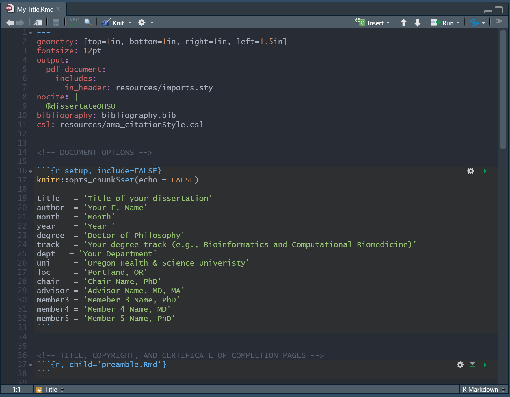
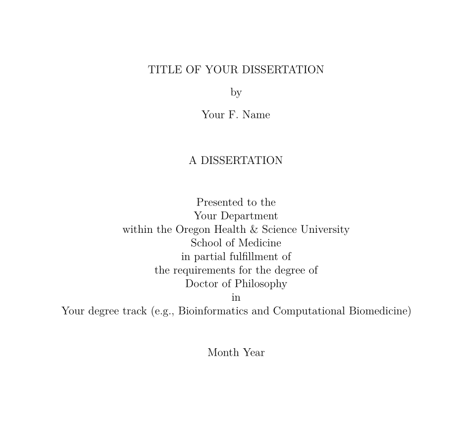

<!-- README.md is generated from README.Rmd. Please edit that file -->

```{r setup, include = FALSE}
knitr::opts_chunk$set(
  collapse = TRUE,
  comment = "#>",
  fig.path = "man/figures/README-",
  out.width = "100%"
)
devtools::load_all()
```

**This is a modified version of [`dissertateUSU`](https://github.com/TysonStanley/dissertateUSU).**

# `dissertateOHSU` `v`r packageVersion("dissertateOHSU")`` 


The goal of `dissertateOHSU` is to make two aspects of writing a dissertation at Oregon Health & Science University a better experience:

1. Formatting of the dissertation is automatically done for you
2. All analyses are intimately tied to the document making the work more reproducible

Ultimately, this allows the student to focus on the writing and the results without having to worry excessively about updating tables and figures, adjusting formatting of things like the title page and table of contents, and other minor (but important) aspects of getting the document correct.

## Installation

You can install `dissertateOHSU` with:

``` r
remotes::install_github("aaroncoyner/dissertateOHSU")
```

## LaTeX

> Importantly, this package requires the new release of LaTeX from your preferred distribution. Older versions will often encounter an error regarding "\\counterwithin". If this error comes up for you, then you need to update your LaTeX.


## Getting Started

**Adapted from [Tyson Barrett](https://tysonbarrett.com/jekyll/update/2018/02/11/r_dissertation/)**

The first, and most important file, is the only file you’ll knit. It is the main .Rmd file, and will be named whatever you have assigned as the template name. The header YAML and document options in this file looks like this:



Most of it contains pieces that, if you’ve used somewhat more advanced RMarkdown, you are probably familiar with. These include the title, author, output, bibliography, and nocite. The documentation for this can be found at RMarkdown’s website.

This file has comments throughout to highlight what each section is doing. It includes the formatting of the title page as well. Using the `setup` section, the title page is populated with the information put there. It does this as, while knitting, a file called preamble.Rmd is written through a function that is found early in the RMarkdown file. This function comes through the dissertateOHSU R package on GitHub (download with devtools::install_github("aaroncoyner/dissertateOHSU")). After installing the package, I recommend using the template to get going using the approach shown below:

Open up a new RMarkdown file:

<br>

Select the "Dissertate OHSU" template:

<br>

This will open up a new folder with a skeleton RMarkdown file:

<br>

This produces a document that matches the OHSU dissertation guidelines:

<br>

<br>

In the folder, there are other RMarkdown files called `aim_1.Rmd`, `aim_2.Rmd`, etc. These are the files where you will do the writing and analyzing. The main RMarkdown file will bring all these files together into one document. The only things you need to update in the main RMarkdown file is the `setup` information.


For the references, use the BibTex file named bibliography.bib. I used Mendeley as my references manager and then exported all of my references to the .bib file. This allowed me to use the regular RMarkdown citing while using csl: ref_format.csl (note that it is CSL and not CLS that is used for the formatting) to format the references correctly (in my case AMA style). This file was downloaded from the [vast repository of csl files](https://github.com/citation-style-language/styles). I looked for the one that fit what I was looking for, downloaded it, and named it ref_format.csl and put it in my dissertation’s directory.


## Notes

- To put the title on two lines (see the thesis cover page above), use `\\newline` at the point where you want the title to split to the second line.
- If you don't need a section, simply remove it from the main `.Rmd` file. 
- For spell checking, use the built-in spell check in RStudio. It's not perfect, but still works well.


## Work in Progress

The package is still undergoing some development and I would love feedback on any aspect that doesn't work as expected.

We also want to thank the [`rticles`](https://github.com/rstudio/rticles) package for the functionality for `dissertateOHSU`. Many of the functions herein were derived directly from `rticles`, just with a custom template and LaTeX style.
